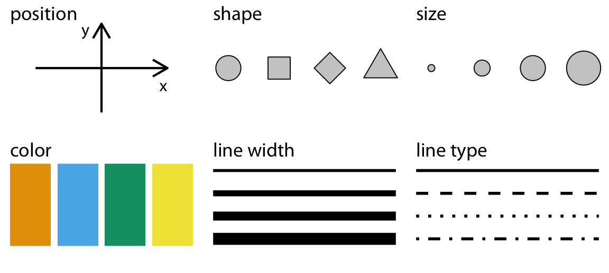

<!-- ************************************************************************ -->
# Grammar of Graphics
<!-- ************************************************************************ -->

## `ggplot2`

* Créé par Hadley Wickham en 2005.

* Page [wikipedia](https://en.wikipedia.org/wiki/Ggplot2).

* [Réference complète](https://ggplot2.tidyverse.org/index.html)

* [Fiche résumée](https://github.com/rstudio/cheatsheets/blob/master/data-visualization-2.1.pdf)

* C'est une librairie `R` stardard :

```{r ggplot2, eval = FALSE}
install.packages("ggplot2")
```
```{r ggplot2-2, eval = TRUE}
library("ggplot2")
```

## Grammar of Graphics

* Un système cohérent pour faire des graphiques [ref](http://vita.had.co.nz/papers/layered-grammar.pdf).

* "Layered aesthetic mappings" : "couches" de choix esthétiques.

* On choisit un mode de représentation pour chaque composante du jeu de données.

<!-- ************************************************************************ -->
# Aesthetic mappings
<!-- ************************************************************************ -->

## Données climatiques

* Températures moyennes journalières [ECAD](https://www.ecad.eu/dailydata/index.php) (1950 - 2019)

```{r temp, message = FALSE}
library(here)
temps_average <- read.csv(file = here("data",
                                      "temp_average.csv"))
head(temps_average)
```

## Climatic data - y

```{r format, echo = FALSE}
month_names <- c(
  "01" = "Jan", "02" = "Feb", "03" = "Mar", "04" = "Apr", "05" = "May", "06" = "Jun",
  "07" = "Jul", "08" = "Aug", "09" = "Sep", "10" = "Oct", "11" = "Nov", "12" = "Dec"
)
month_days <- c(31, 29, 31, 30, 31, 30, 31, 31, 30, 31, 30, 31)
month_days_cum <- c(0, cumsum(month_days))
```

```{r temp-plot, echo = FALSE, fig.align='center'}
ggplot(temps_average, aes(x = day_of_year, y = temperature, color = city)) +
  geom_line(size = 1) +
  scale_x_continuous(name = "day of the year",
                     breaks = month_days_cum[-13] + 1,
                     labels = month_names) +
  theme_light()
```

* `y` contient l'information sur la `temperature`.
* `color` contient l'information sur la `city`.

## Climatic data - color
```{r temp-plot-2, echo = FALSE, fig.align='center'}
ggplot(temps_average, aes(x = day_of_year, y = city, color = temperature)) + 
  geom_point(size = 5) +
  scale_x_continuous(name = "day of the year",
                     breaks = month_days_cum[-13] + 1,
                     labels = month_names) + 
  scale_color_viridis_c(
    option = "B", begin = 0.15, end = 0.98,
    name = "temperature"
  ) + 
  theme_light()
```

* `y` contient l'information sur la `city`.
* `color` contient l'information sur la `temperature`.

## Commonly used aesthetics {.smaller}

<center></center>

Figure tirée de [Claus O. Wilke. *Fundamentals of Data Visualization.* O'Reilly, 2019.](https://clauswilke.com/dataviz)

## Données climatiques - `aes`

```{r temp-plot-aes, echo = TRUE, fig.height=3, fig.width=6, fig.align='center'}
ggplot(temps_average,                     ## données
       aes(x = day_of_year,               ## axe x
           y = temperature,               ## axe y
           color = city)) +               ## couleur
  geom_line(size = 1)                     ## tracer une ligne
```

## Données climatiques - `aes`

```{r temp-plot-aes-2, echo = TRUE, fig.height=3, fig.width=6, fig.align='center'}
ggplot(temps_average,                     ## données
       aes(x = day_of_year,               ## axe x
           y = city,                      ## axe y
           color = temperature)) +        ## couleur
  geom_point(size = 5)                    ## tracer des points
```

## Références

- *Fundamentals of Data Visualization*:  
[Chapter 2: Visualizing data](https://clauswilke.com/dataviz/aesthetic-mapping.html)
- *Data Visualization—A Practical Introduction*:  
[Chapter 3: Make a plot](https://socviz.co/makeplot.html#makeplot)
- [**ggplot2** reference documentation](https://ggplot2.tidyverse.org/reference/index.html)
- [**ggplot2** book](https://ggplot2-book.org/)
- [**ggplot2** cheatsheet](https://github.com/rstudio/cheatsheets/raw/master/data-visualization-2.1.pdf)
