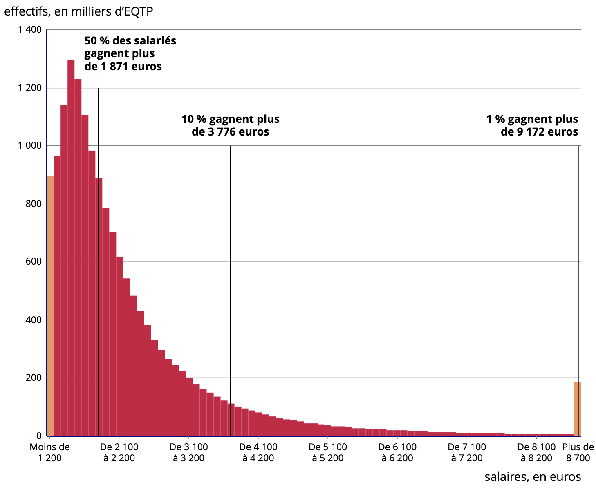

<!-- ************************************************************************ -->
# Variables Quantitatives
<!-- ************************************************************************ -->

## Variables quantitatives {.build}

**Quantitative discrète**: La variable est un nombre "isolé"

* Nombre d'enfants
* Température moyenne journalière à Montpellier
* Age des passagers du Titanic

**Quantitative continue**: La variable est un nombre réel

* Montant des impôts sur le revenu
* Température moyenne journalière à Montpellier
* Age des passagers du Titanic

<!-- ************************************************************************ -->
# Variables Quantitatives Discrètes
<!-- ************************************************************************ -->

## Nombre d'enfants par couple {.build}

On s'intéresse au nombre d'enfants de moins de 25 ans par couples en France en 2017 [[source](https://www.insee.fr/fr/statistiques/4516614?sommaire=4516657&geo=FE-1)].

**Individu**: un couple 

**Population**: tous les couples français 

**Échantillon**: couples déclarés lors du recensement INSEE 2017

**Taille**: 15 353 382

**Variable**: nombre d'enfants

## Statistiques {.build}

**Modalités**: ordonnées, indicées par $i \in \{1, 2, \cdots, K\}$

**Effectif** $n_i$: nombre d'individus  d'une modalité.

**Fréquence** $f_i = \frac{n_i}{n}$: effectif d'une modalité sur l'effectif total.

**Effectif cumulé** $N_i$: somme des effectifs avant $i$:
$$
N_i = \sum_{j = 1}^i n_j
$$

**Fréquence cumulée** $F_i$: effectif cumulé sur l'effectif total:
$$
F_i = \sum_{j = 1}^i f_j = \frac{N_i}{n}
$$

## Nombre d'enfants par couple {.smaller}

```{r, echo = FALSE, message = FALSE}
library(here)
couples_data <- read.csv(here("data", "couples.csv"), sep = ";")
effectifs <- as.numeric(couples_data[couples_data$Couple == "Ensemble",
                                     !colnames(couples_data) %in% c("Couple", "Ensemble")])
couples <- data.frame(enfants = c(0:3, "4+"),
                      effectif = effectifs,
                      fréquence = effectifs / sum(effectifs),
                      effectif_cumulee = cumsum(effectifs),
                      fréquence_cumulée = cumsum(effectifs) / sum(effectifs))
couples_pretty <- couples
colnames(couples_pretty) <- c("Nombre d'enfants ($x_i$)",
                       "Effectif ($n_i$)",
                       "Fréquence ($f_i$)",
                       "Effectif cumulé ($N_i$)",
                       "Fréquence cumulée ($F_i$)")
knitr::kable(couples_pretty)
```

## Représentations

```{r, fig.height=3, fig.width=8, fig.align='center', echo = FALSE}
library(ggplot2)
freq <- ggplot(couples,
               aes(x = enfants,
                   y = fréquence,
                   group = 1)) +
  geom_line() +
  scale_y_continuous(name = "Fréquence",
                     sec.axis = sec_axis(trans = ~. *  sum(effectifs), name="Effectif")) + 
  ggtitle("Polygone des fréquences") + xlab("Nombre d'enfants") + theme_minimal()


bound <- data.frame(enfants = "0",
                     effectif = 0,
                     fréquence = 0,
                     effectif_cumulee = 0,
                     fréquence_cumulée = 0)
couples_plot <- rbind(bound[1, ], couples)

cumfreq <- ggplot(couples_plot,
                  aes(x = enfants,
                      y = fréquence_cumulée,
                      group = 1)) +
  geom_step() + 
  ggtitle("Fréquences cumulées croissantes") + 
  ylab("Fréquences cumulées") + xlab("Nombre d'enfants") + theme_minimal()

cowplot::plot_grid(
  freq, cumfreq,
  nrow = 1#, rel_widths = c(1.05, .65, .9)
)
```

$~$

Exploite le fait que les modalités sont **ordonnées**.

## Mode {.smaller}

Le **mode** est la ou les modalité(s) pour laquelle l'effectif est maximum.

```{r, echo = FALSE, message = FALSE}
knitr::kable(couples_pretty)
```

$~$

Mode: couples avec `r couples$enfants[which.max(couples$effectif)]` enfant.

<!-- ************************************************************************ -->
# Variables Quantitatives Continues
<!-- ************************************************************************ -->

## Âge des passagers du Titanic {.build}

On s'intéresse à l'âge des passagers du Titanic.

**Individu**: un passager du Titanic 

**Population**: tous les passagers du Titanic

**Échantillon**: passagers du Titanic référencés

**Taille**: 756

**Variable**: âge

## Âge des passagers du Titanic

```{r, echo = FALSE, message = FALSE}
library(Stat2Data)
data(Titanic)
Titanic <- na.omit(Titanic)
knitr::kable(Titanic[order(Titanic$Age)[1:6], ], row.names = FALSE)
```

$~$ 

Source: [Encyclopedia Titanica](https://www.encyclopedia-titanica.org/),
par la librairie [Stat2Data](https://CRAN.R-project.org/package=Stat2Data)

## Quantitatives Continues $\to$ Discrète {.build}

On replace la variable continue par sa classe.

**Classe** : Valeurs regroupées, comprises entre $a_i$ et $a_{i+1}$.

**Effectif** d'une classe : nombre d'individus tq $x_i \in [a_i, a_{i+1}]$.

**Fréquence** d'une classe : effectif sur nombre total.

**Amplitude** : Longueur de la classe $A_i = a_{i+1} - a_i$.

**Densité** : fréquence divisée par l'amplitude:
$$
h_i = \frac{f_i}{A_i}
$$

## Âge des passagers du Titanic {.smaller}

```{r echo = FALSE}
age_counts <- hist(Titanic$Age, breaks = (0:15) * 5 + .01, plot = FALSE)$counts
age_hist <- data.frame(
  classe = c("[0;5]", "]5;10]", "]10;15]", "]15;20]", "]20;25]", "]25;30]", "]30;35]", "]35;40]", "]40;45]", "]45;50]", "]50;55]", "]55;60]", "]60;65]", "]65;70]", "]70;75]", "]75;80]"),
  amplitude = 5,
  effectif = c(age_counts, 0),
  fréquence = paste(c(age_counts, 0), "/", nrow(Titanic)),
  densité = paste(c(age_counts, 0), "/", nrow(Titanic), "/", "5")
)
```

```{r echo = FALSE}
knitr::kable(age_hist[1:8, ])
```


## Mode {.smaller}

Le **mode** est la ou les classe(s) pour laquelle l'effectif est maximum.

```{r echo = FALSE}
knitr::kable(age_hist[1:7, ])
```

$~$

Mode: passagers d'âge entre `r age_hist$classe[which.max(age_hist$effectif)]`.

## Histograme: classes en barres

```{r, fig.height=3, fig.width=6, fig.align='center', echo = TRUE}
ggplot(Titanic, aes(x = Age)) +  ## Age en abscisse
  geom_histogram(                ## Histogramme
    binwidth = 5,                ## Largeur des classes
    center = 2.5                 ## Centre des classes
    )
```

## Histograme - Densité

```{r, fig.height=3, fig.width=6, fig.align='center', echo = TRUE}
ggplot(Titanic, aes(x = Age)) +   ## Age en abscisse
  geom_histogram(                 ## Histogramme
    aes(y = after_stat(density)), ## Densité à la place des comptages
    binwidth = 5,                 ## Largeur des classes
    center = 2.5                  ## Centre des classes
  )
```

## Histograme - plus de classes

```{r, fig.height=3, fig.width=6, fig.align='center', echo = TRUE}
ggplot(Titanic, aes(x = Age)) +   ## Age en abscisse
  geom_histogram(                 ## Histogramme
    aes(y = after_stat(density)), ## Densité à la place des comptages
    binwidth = 1,                 ## Largeur des classes
    center = 0.5                  ## Centre des classes
    )
```

<!-- ## Polynome des fréquences -->

<!-- ```{r, fig.height=3, fig.width=6, fig.align='center', echo = TRUE} -->
<!-- ggplot(Titanic, aes(x = Age)) +  ## Age en abscisse -->
<!--   geom_freqpoly(                ## Histogramme -->
<!--     binwidth = 5,                ## Largeur des classes -->
<!--     center = 2.5                 ## Centre des classes -->
<!--     ) -->
<!-- ``` -->

<!-- ## Estimateur à noyaux -->

<!-- ```{r, fig.height=3, fig.width=6, fig.align='center', echo = TRUE} -->
<!-- ggplot(Titanic, aes(Age)) + -->
<!--   geom_density() -->
<!-- ``` -->

<!-- ## Histogramme et estimateur à noyaux -->

<!-- ```{r, fig.height=3, fig.width=6, fig.align='center', echo = TRUE} -->
<!-- ggplot(Titanic, aes(Age)) + -->
<!--   geom_histogram(aes(y = after_stat(density)), binwidth = 5, center = 2.5) +  -->
<!--   geom_density() -->
<!-- ``` -->


<!-- ************************************************************************ -->
# Statistiques Descriptives
<!-- ************************************************************************ -->

## Variables Quantitatives Continues

* Regroupement par classes 
  - $\to$ variable quantitative discrète
  - $\to$ histogramme
  
* Pas de regroupement
  - $\to$ statistiques descriptives
  
## Température Moyenne à Montpellier {.build}

On s'intéresse aux mesures de températures journalières à Montpellier les
premier janviers dans les années 50.

**Individu**: un premier janvier

**Population**: tous les premiers janviers

**Échantillon**: les premiers janviers entre 1951 et 1959

**Taille**: 9

**Variable**: température moyenne sur la journée
 
## Température Moyenne à Montpellier {.smaller}

<div style="float: left; width: 40%;">
```{r, echo = FALSE}
montpellier <- read.csv(file = here("data", "temp_montpellier.csv"))
montpellier <- subset(montpellier, month == 1 & day == 1 & year >= 1951 & year <= 1959)
montpellier <- montpellier[, c("year", "month", "day", "temperature")]
knitr::kable(montpellier, row.names = FALSE)
```
</div>

<div style="float: right; width: 60%;">
```{r, fig.height=3, fig.width=4, fig.align='center', echo = FALSE}
ggplot(montpellier, aes(temperature)) +
  geom_histogram(aes(y = after_stat(density)), binwidth = 1, center = 0.5, alpha = 0.7 ) + 
  geom_density(fill = "blue", alpha = 0.5) + 
  ggtitle("Temperature distribution") +
  theme_minimal() +
  xlab("mean temperature (°C)")
```
</div>

## Statistiques descriptives {.build}

**But**: résumer la distribution des points par quelques scores (ou statistiques).

Uniquement pour des **variables quantitatives**

**Paramètres de position**: Moyenne, médiane, ...

**Paramètres de dispersion**: variance, écart-type, ...

<!-- ************************************************************************ -->
# Paramètres de position
<!-- ************************************************************************ -->

## Moyenne

On note $x_1, \dotsc, x_n$ les variables aléatoires mesurées pour chaque point
de l'échantillon.  

*$x_i$: la température le premier janvier à Montpellier l'année $i$*

**Moyenne**:
$$
\bar{x} = \frac{1}{n}\sum_{i = 1}^n x_i
$$

*La température moyenne un 1er janvier à Montpellier dans les années 50 est de `r round(mean(montpellier$temperature), 2)`°C*

## Médiane {.build .smaller}

**Médiane**:
Point tel que $50\%$ des données sont à droite, et $50\%$ à gauche.

<div style="float: left; width: 40%;">
```{r, echo = FALSE}
knitr::kable(montpellier[order(montpellier$temperature), ], row.names = FALSE)
```
</div>

<div style="float: right; width: 50%;">

Moyenne : 
```{r}
mean(montpellier$temperature)
```

Médiane :
```{r}
median(montpellier$temperature)
```

</div>

## Médiane {.smaller}

<div style="float: left; width: 40%;">
```{r, echo = FALSE}
montpellier2 <- read.csv(file = here("data", "temp_montpellier.csv"))
montpellier2 <- subset(montpellier2, month == 1 & day == 1 & ((year >= 1951 & year <= 1959) | year == 2015 | year == 2016))
montpellier2 <- montpellier2[, c("year", "month", "day", "temperature")]
knitr::kable(montpellier2[order(montpellier2$temperature), ], row.names = FALSE)
```
</div>

<div style="float: right; width: 50%;">

Moyenne : `r round(mean(montpellier2$temperature), 2)`°C

Médiane : `r round(median(montpellier2$temperature), 2)`°C

La médiane est plus robuste que la moyenne.
</div>


## Médiane

La médiane est plus robuste que la moyenne.

<center></center>

Revenu net **médian** en France en 2018 : 1 871 € par mois  
Revenu net **moyen** en France en 2018 : 2 369 € par mois  
[Source: [INSEE](https://www.insee.fr/fr/statistiques/4990766)]

## Quartiles {.build}

**Quartile à 0.25** :
Point tel que $25\%$ des données sont à gauche, et $75\%$ à droite

**Quartile à 0.5**
Point tel que $50\%$ des données sont à gauche, et $50\%$ à droite  
$\to$ **médiane**

**Quartile à 0.75**:
Point tel que $75\%$ des données sont à gauche, et $25\%$ à droite

## Quartiles {.build .smaller}

<div style="float: left; width: 40%;">
```{r, echo = FALSE}
knitr::kable(montpellier[order(montpellier$temperature), ], row.names = FALSE)
```
</div>

<div style="float: right; width: 50%;">

Moyenne : `r round(mean(montpellier$temperature), 2)`°C

Médiane : `r median(montpellier$temperature)`°C

Quartile 0.25 : `r quantile(montpellier$temperature, c(0.25))`°C

Quartile 0.5 : `r quantile(montpellier$temperature, c(0.5))`°C

Quartile 0.75 : `r quantile(montpellier$temperature, c(0.75))`°C

```{r}
quantile(montpellier$temperature,
         c(0.25, 0.5, 0.75))
```

</div>


## Quantiles {.build}

**Fonction de répartition empirique**:
$$
F_n(t) = \frac{\text{nombre d'élements $\leq t$ dans l'échantillon}}{n}
$$

$$
F_n(t) = \frac{1}{n} \sum_{i = 1}^n \mathbb{1}\{x_i \leq t\}
\qquad
\text{avec: }
\mathbb{1}\{x_i \leq t\} = 
\begin{cases}
1 & \text{if } x_i \leq t\\
0 & \text{sinon.}
\end{cases}
$$

**Quantile de niveau $\alpha$** ($0 < \alpha < 1$) :
$$
q_{\alpha} = \inf\{t\ |\ F_n(t) \geq \alpha \}
$$

Plus petite valeur telle qu'au moins une fraction $\alpha$ des individus aient une
valeur plus petite.

## Quantiles {.build}

**Fonction de répartition empirique**:
$F_n(t) = \frac{1}{n} \sum_{i = 1}^n \mathbb{1}\{x_i \leq t\}$

**Quantile de niveau $\alpha$** ($0 < \alpha < 1$) :
$q_{\alpha} = \inf\{t\ |\ F_n(t) \geq \alpha \}$

**Cas particuliers**:

$q_{0.5}$: médiane

$q_{0.25}, q_{0.75}$: quartiles

$q_{0.1}, q_{0.2}, \dotsc, q_{0.9}$: déciles

$q_{0.01}, q_{0.02}, \dotsc, q_{0.99}$: centiles

## Boîte à moustaches (sans moustaches) {.smaller}

<div style="float: left; width: 40%;">
```{r, echo = FALSE}
knitr::kable(montpellier[order(montpellier$temperature), ], row.names = FALSE)
```
</div>

<div style="float: right; width: 50%;">

```{r, fig.height=5, fig.width=1.5, fig.align='center', echo = FALSE}
ggplot(montpellier, aes(y = temperature)) +
  geom_boxplot(coef = 0, outlier.alpha = 0) + 
 geom_jitter(aes(x = 0), color="black", size=0.4, alpha=0.7) +  
  ggtitle("Boxplot") +
  theme_classic() +
  theme(
    axis.line.x = element_blank(),
    axis.ticks.x = element_blank(),
    axis.text.x = element_blank()
  ) +
  scale_y_continuous(breaks = quantile(montpellier$temperature, c(0.25, 0.5, 0.75)),
                     labels = c(expression(q[0.25]), expression(q[0.5]), expression(q[0.75]))) + 
  xlab(NULL)
```

</div>

## Boîte à moustaches (sans moustaches) {.smaller}

```{r, echo = FALSE}
montpellier3 <- read.csv(file = here("data", "temp_montpellier.csv"))
montpellier3 <- subset(montpellier3, month == 1 & day == 1 & year >= 1951 & year <= 1999)
montpellier3 <- montpellier3[, c("year", "month", "day", "temperature")]
```

<div style="float: left; width: 50%;">
```{r, fig.height=5, fig.width=1.5, fig.align='center', echo = FALSE}
ggplot(montpellier, aes(y = temperature)) +
  geom_boxplot(coef = 0, outlier.alpha = 0) + 
 geom_jitter(aes(x = 0), color="black", size=0.4, alpha=0.7) +  
  ggtitle("1951 - 59") +
  theme_classic() +
  theme(
    axis.line.x = element_blank(),
    axis.ticks.x = element_blank(),
    axis.text.x = element_blank()
  ) +
  scale_y_continuous(breaks = quantile(montpellier$temperature, c(0.25, 0.5, 0.75)),
                     labels = c(expression(q[0.25]), expression(q[0.5]), expression(q[0.75]))) + 
  xlab(NULL)
```
</div>

<div style="float: right; width: 50%;">

```{r, fig.height=5, fig.width=1.5, fig.align='center', echo = FALSE}
ggplot(montpellier3, aes(y = temperature)) +
  geom_boxplot(coef = 0, outlier.alpha = 0) + 
  geom_jitter(aes(x = 0), color="black", size=0.4, alpha=0.7) +  
  ggtitle("1951 - 99") +
  theme_classic() +
  theme(
    axis.line.x = element_blank(),
    axis.ticks.x = element_blank(),
    axis.text.x = element_blank()
  ) +
  scale_y_continuous(breaks = quantile(montpellier3$temperature, c(0.25, 0.5, 0.75)),
                     labels = c(expression(q[0.25]), expression(q[0.5]), expression(q[0.75]))) + 
  xlab(NULL)
```

</div>

<!-- ************************************************************************ -->
# Paramètres de dispersion
<!-- ************************************************************************ -->

## Variance et Ecart-type {.build}

<div style="float: left; width: 50%;">
```{r, fig.height=3, fig.width=3, fig.align='center', echo = FALSE}
set.seed(1289)
montpellier$jit <- runif(nrow(montpellier), -0.05, 0.05)
ggplot(montpellier, aes(y = temperature)) +
 geom_point(aes(x = jit), color="black") +  
  # ggtitle("Variance") +
  geom_hline(yintercept = mean(montpellier$temperature), color = "blue", linewidth = 1.5) + 
  geom_segment(aes(x = jit, xend = jit, yend = mean(temperature))) + 
  theme_classic() +
  theme(
    axis.line.x = element_blank(),
    axis.ticks.x = element_blank(),
    axis.text.x = element_blank()
  ) +
  scale_y_continuous(breaks = mean(montpellier$temperature),
                     labels = expression(bar(x))) + 
  xlab(NULL)
```
</div>

<div style="float: right; width: 50%;">
**Variance**:
$$
s_x^2 = \frac{1}{n-1} \sum_{i = 1}^n (x_i - \bar{x})^2
$$

**Écart-type**:
$$
s_x = \sqrt{s_x^2}
$$
En anglais:  
*standard deviation* (*sd*)
</div>

## Variance et Ecart-type

<div style="float: left; width: 50%;">
```{r, fig.height=5, fig.width=1.5, fig.align='center', echo = FALSE}
ggplot(montpellier3, aes(y = temperature)) +
  geom_boxplot(coef = 0, outlier.alpha = 0) + 
  geom_jitter(aes(x = 0), color="black", size=0.4, alpha=0.7) +  
  ggtitle("1951 - 99") +
  theme_classic() +
  theme(
    axis.line.x = element_blank(),
    axis.ticks.x = element_blank(),
    axis.text.x = element_blank()
  ) +
  scale_y_continuous(breaks = quantile(montpellier3$temperature, c(0.25, 0.5, 0.75)),
                     labels = quantile(montpellier3$temperature, c(0.25, 0.5, 0.75))) + 
  xlab(NULL)
```
</div>

<div style="float: right; width: 50%;">

**Variance**: $(°C)^2$
```{r}
var(montpellier3$temperature)
```

**Écart-type**: $°C$
```{r}
sd(montpellier3$temperature)
```

**Attention**: seul l'écart-type est comparable aux données.


</div>

## Étendue et écart inter-quartiles

<div style="float: left; width: 50%;">
```{r, fig.height=5, fig.width=1.5, fig.align='center', echo = FALSE}
ggplot(montpellier3, aes(y = temperature)) +
  geom_boxplot(coef = 0, outlier.alpha = 0) + 
  geom_jitter(aes(x = 0), color="black", size=0.4, alpha=0.7) +  
  ggtitle("1951 - 99") +
  theme_classic() +
  theme(
    axis.line.x = element_blank(),
    axis.ticks.x = element_blank(),
    axis.text.x = element_blank()
  ) +
  scale_y_continuous(breaks = quantile(montpellier3$temperature),
                     labels = quantile(montpellier3$temperature)) + 
  xlab(NULL)
```
</div>

<div style="float: right; width: 50%;">

**Étendue**: 
$$
L = \max(x) - \min(x)
$$

$$
L = `r max(montpellier3$temperature)` - (`r min(montpellier3$temperature)`)
= `r max(montpellier3$temperature) - min(montpellier3$temperature)`
$$

**Écart inter-quartiles**: 
$$
IQR = q_{0.75} - q_{0.25}
$$

$$
IQR = `r quantile(montpellier3$temperature, 0.75)` - `r quantile(montpellier3$temperature, 0.25)`
= `r quantile(montpellier3$temperature, 0.75) - quantile(montpellier3$temperature, 0.25)`
$$

</div>

## Écart inter-quantiles {.build}

**Intervalle inter-quartiles**: 
$$
IQ = \left[q_{0.25}, q_{0.75}\right]
= \left[q_{\frac{1 - 0.5}{2}}, q_{\frac{1 + 0.5}{2}}\right]
$$

contient $50\%$ des observations.

**Intervalle inter-quantile** de niveau $\beta$ ($0 < \beta < 1$):
$$
IQ_\beta= \left[q_{\frac{1 - \beta}{2}}, q_{\frac{1 + \beta}{2}}\right]
$$

contient une proportion $\beta$ des observations.

## Moustaches

**Écart inter-quartiles**: 
$$
IQ = \left[q_{0.25};\ q_{0.75}\right]
$$

$$
IQR = q_{0.75} - q_{0.25}
$$

**Moustaches**: (en anglais: *whisker*)
$$
W_{min} = \max\{M_n - 1.5·IQR;\ \min(x)\}
$$

$$
W_{max} = \min\{M_n + 1.5·IQR;\ \max(x)\}
$$

**Données "aberrantes"** (*outliers*):  
points en dehors de l'intervalle $W = [W_{min};\ W_{max}]$.

## Boîte à moustaches (*boxplot*)

<div style="float: left; width: 30%;">
```{r, fig.height=5, fig.width=1.5, fig.align='center', echo = FALSE}
ggplot(montpellier3, aes(y = temperature)) +
  geom_boxplot() + 
  geom_jitter(aes(x = 0), color="black", size=0.4, alpha=0.7) +  
  ggtitle("1951 - 99") +
  theme_classic() +
  theme(
    axis.line.x = element_blank(),
    axis.ticks.x = element_blank(),
    axis.text.x = element_blank()
  ) +
  scale_y_continuous(breaks = quantile(montpellier3$temperature),
                     labels = quantile(montpellier3$temperature)) + 
  xlab(NULL)
```
</div>

<div style="float: right; width: 70%;">

**Écart inter-quartiles**: 
$$
\begin{aligned}
IQR 
&= q_{0.75} - q_{0.25} \\
&= `r quantile(montpellier3$temperature, 0.75)` - `r quantile(montpellier3$temperature, 0.25)`
= `r quantile(montpellier3$temperature, 0.75) - quantile(montpellier3$temperature, 0.25)`
\end{aligned}
$$

**Moustache**: 
$$
\begin{aligned}
W_{min} 
&= \max\{M_n - 1.5·IQR;\ \min(x)\} \\
&= \max\{
`r quantile(montpellier3$temperature, 0.5)` 
- 1.5·`r quantile(montpellier3$temperature, 0.75) - quantile(montpellier3$temperature, 0.25)`;\ 
`r min(montpellier3$temperature)`\} \\
& = `r max(c(quantile(montpellier3$temperature, 0.5) - 1.5*(quantile(montpellier3$temperature, 0.75) - quantile(montpellier3$temperature, 0.25)), min(montpellier3$temperature)))`
\end{aligned}
$$

$$
\begin{aligned}
W_{max} 
&= \min\{M_n + 1.5·IQR;\ \max(x)\} \\
&= \min\{
`r quantile(montpellier3$temperature, 0.5)` 
+ 1.5·`r quantile(montpellier3$temperature, 0.75) - quantile(montpellier3$temperature, 0.25)`;\ 
`r max(montpellier3$temperature)`\} \\
& = `r min(c(quantile(montpellier3$temperature, 0.5) + 1.5*(quantile(montpellier3$temperature, 0.75) - quantile(montpellier3$temperature, 0.25)), max(montpellier3$temperature)))`
\end{aligned}
$$


</div>

## Comparaisons {.build}

On veut comparer les températures au premier janvier et au premier juin
à Montpellier entre 1951 et 1999.

**Question**: Les températures au premier janvier et au premier juin à Montpellier
sont elles significativement différentes ?


**Population 1**: tous les premiers janviers entre 1951 et 1999

**Population 2**: tous les premiers juins entre 1951 et 1999

**Variable**: température moyenne sur la journée

$\to$ On peut comparer les deux populations à l'aide de boîtes à moustaches.

## Comparaisons - Janvier / Juin

Comparaison entre les températures au premier janvier et au premier juin
à Montpellier entre 1951 et 1999.

```{r, echo = FALSE}
montpellier4 <- read.csv(file = here("data", "temp_montpellier.csv"))
montpellier4 <- subset(montpellier4, month %in% c(1, 6) & day == 1 & year >= 1951 & year <= 1999)
montpellier4 <- montpellier4[, c("year", "month", "day", "temperature")]
montpellier4$month <- as.factor(montpellier4$month)
```

```{r, fig.height=4, fig.width=5, fig.align='center', echo = FALSE}
ggplot(montpellier4, aes(x = month, y = temperature, fill = month)) +
  geom_boxplot(alpha=0.7) + 
  geom_jitter(aes(color = month), size=0.4, alpha=0.7) +  
  ggtitle("1951 - 99") +
  theme_minimal() + 
  scale_x_discrete(name = "", labels = c("1er Jan", "1er Juin")) +
  scale_fill_discrete(guide = NULL) + 
  scale_color_discrete(guide = NULL)
```

## Comparaisons - Janvier / Février

Comparaison entre les températures au premier janvier et au premier février
à Montpellier entre 1951 et 1999.

```{r, echo = FALSE}
montpellier4 <- read.csv(file = here("data", "temp_montpellier.csv"))
montpellier4 <- subset(montpellier4, month %in% c(1, 2) & day == 1 & year >= 1951 & year <= 1999)
montpellier4 <- montpellier4[, c("year", "month", "day", "temperature")]
montpellier4$month <- as.factor(montpellier4$month)
```

```{r, fig.height=4, fig.width=5, fig.align='center', echo = FALSE}
ggplot(montpellier4, aes(x = month, y = temperature, fill = month)) +
  geom_boxplot(alpha=0.7) + 
  geom_jitter(aes(color = month), size=0.4, alpha=0.7) +  
  ggtitle("1951 - 99") +
  theme_minimal() + 
  scale_x_discrete(name = "", labels = c("1er Jan", "1er Fév")) +
  scale_fill_discrete(guide = NULL) + 
  scale_color_discrete(guide = NULL)
```

<!-- ************************************************************************ -->
# Statistiques Descriptives - Résumé
<!-- ************************************************************************ -->

## Statistiques Résumées {.build}

* Uniquement pour des **variables quantitatives**

* **Paramètres de position**:

  * Moyenne
  * Médiane
  * Quantiles
  * Mode (par classes)

* **Paramètres de dispersion**: 
  * Variance
  * Écart-type
  * Intervalles inter-quantiles
  * Étendue

## Attention {.build}

On cherche à résumer une information complexe (tableau de données)
par quelques chiffres (statistiques)

**"Résumer n'est pas jouer"**

$\to$ les statistiques descriptives ne donnent qu'une vision partielle des données.

## Exemple {.smaller}

```{r, echo = FALSE}
library(datasauRus)
data1 <- subset(datasaurus_dozen, dataset == "dino")[, c("x", "y")]
data2 <- subset(datasaurus_dozen, dataset == "star")[, c("x", "y")]
```

<div style="float: left; width: 40%;">
Jeu de données 1:

```{r, echo = FALSE}
knitr::kable(data1)
```
</div>

<div style="float: right; width: 40%;">

Jeu de données 2:

```{r, echo = FALSE}
knitr::kable(data2)
```

</div>

## Exemple {.smaller}

Les moyennes et écart-types sont très similaires...

<div style="float: left; width: 40%;">
Jeu de données 1:

Moyenne x: `r mean(data1$x)`

Moyenne y: `r mean(data1$y)`

Écart-type x: `r sd(data1$x)`

Écart-type y: `r sd(data1$y)`

</div>

<div style="float: right; width: 40%;">

Jeu de données 2:

Moyenne x: `r mean(data2$x)`

Moyenne y: `r mean(data2$y)`

Écart-type x: `r sd(data2$x)`

Écart-type y: `r sd(data2$y)`

</div>

## Exemple {.smaller}

... et pourtant, les données ne se ressemblent pas du tout !

<div style="float: left; width: 40%;">
Jeu de données 1:

```{r, fig.height=3.5, fig.width=3.5, fig.align='center', echo = FALSE}
ggplot(data1, aes(x = x, y = y)) + geom_point() + theme_minimal()
```

</div>

<div style="float: right; width: 40%;">

Jeu de données 2:

```{r, fig.height=3.5, fig.width=3.5, fig.align='center', echo = FALSE}
ggplot(data2, aes(x = x, y = y)) + geom_point() + theme_minimal()
```

Source : package [datasauRus](https://cran.r-project.org/web/packages/datasauRus/vignettes/Datasaurus.html).

</div>


## Références

- *Fundamentals of Data Visualization* :  
[Chapter 7: Visualizing distributions](https://clauswilke.com/dataviz/histograms-density-plots.html)  
- *Data Visualization—A Practical Introduction* :  
[4.6 Histograms and density plots](https://socviz.co/groupfacettx.html#histograms)
- **ggplot2** reference documentation:  
[`geom_histogram()`](https://ggplot2.tidyverse.org/reference/geom_histogram)  
[`geom_boxplot()`](https://ggplot2.tidyverse.org/reference/geom_histogram)  
[`position_jitter()`](https://ggplot2.tidyverse.org/reference/position_jitter.html)
