```{r setup, echo = FALSE}
library(ggplot2)
library(ggforce)
```

<!-- ************************************************************************ -->
# Cherchez l'erreur : Vaccins
<!-- ************************************************************************ -->

## Vaccins

<center>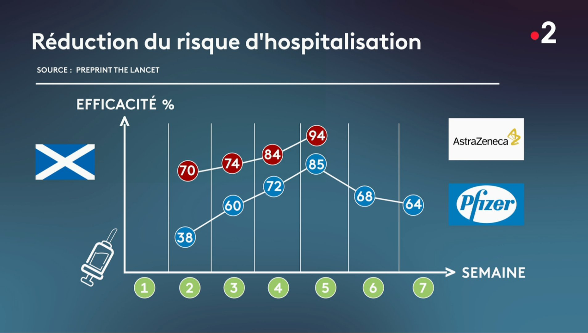</center>

## Vaccins : données {.smaller}

```{r}
hospi <- data.frame(semaine = 1:7,
                    AstraZeneca = c(NA, 70, 74, 84, 94, NA, NA),
                    Pfizer = c(NA, 38, 60, 72, 85, 68, 64))
hospi
```

## Vaccins : données {.smaller}

```{r}
hospi <- tidyr::pivot_longer(hospi, cols = c(AstraZeneca, Pfizer),
                             names_to = "Vaccin", values_to = "Efficacite")
hospi
```

## Vaccins : graphique

```{r, fig.height=3, fig.width=6, fig.align='center', warning = FALSE}
ggplot(hospi, aes(x = semaine, y = Efficacite, color = Vaccin)) +
  geom_line() + geom_point() +
  geom_label(aes(label = Efficacite)) + 
  scale_x_continuous(breaks = 1:7) + 
  theme_minimal() + 
  theme(panel.grid.minor = element_blank())
```

<!-- ************************************************************************ -->
# Cherchez l'erreur : Grèves
<!-- ************************************************************************ -->

## Grèves SNCF

<center></center>

[Source](https://www.liberation.fr/checknews/2018/04/27/est-ce-que-bfmtv-a-vraiment-affiche-un-graphique-a-camembert-trompeur-sur-le-soutien-a-la-greve-des-_1653615/)


<!-- ************************************************************************ -->
# Cherchez l'erreur : Grèves
<!-- ************************************************************************ -->

## Grèves SNCF

<center></center>

[Source](https://www.liberation.fr/checknews/2018/04/27/est-ce-que-bfmtv-a-vraiment-affiche-un-graphique-a-camembert-trompeur-sur-le-soutien-a-la-greve-des-_1653615/)

## Grèves SNCF : données

```{r}
greve <- data.frame(opinion = c("opposition", "indifférent", "soutien"),
                    pourcent = c(48, 15, 37))
greve
```

```{r, echo = FALSE}
greve <- greve[order(greve$pourcent), ]
greve_pie <- greve
greve_pie$end_angle <- 2*pi*cumsum(greve$pourcent)/sum(greve$pourcent)   # ending angle for each pie slice
greve_pie$start_angle <- c(0, greve_pie$end_angle[-3]) # starting angle for each pie slice
greve_pie$mid_angle = 0.5*(greve_pie$start_angle + greve_pie$end_angle) # middle of each pie slice, for the text label
greve_pie$hjust = ifelse(greve_pie$mid_angle > pi, 1, 0)
greve_pie$vjust = ifelse(greve_pie$mid_angle < pi/2 | greve_pie$mid_angle > 3*pi/2, 0, 1)
```

## Grèves SNCF : graphique

```{r, fig.height=3, fig.width=6, fig.align='center', warning = FALSE, eval = FALSE}
ggplot(greve,
       aes(x0 = 0, y0 = 0, r0 = 0, r = 1,
           amount = pourcent,
           fill = opinion)) +
  xlab(NULL) + ylab(NULL) + coord_fixed() +
  ggtitle("Que pensez-vous de la mobilisation des 
  organisations syndicales contre le
  projet de réforme du gouvernement ?") + 
  ggforce::geom_arc_bar(stat = "pie", color = "white") +
  scale_fill_manual(values = c("opposition" = "red4",
                               "indifférent" = "snow4",
                               "soutien" = "darkgreen")) +
  theme_void()
```

## Grèves SNCF : graphique

```{r, fig.height=3, fig.width=6, fig.align='center', warning = FALSE, echo = FALSE}
ggplot(greve,
       aes(x0 = 0, y0 = 0, r0 = 0, r = 1,
           amount = pourcent,
           fill = opinion)) +
  xlab(NULL) + ylab(NULL) + coord_fixed() +
  ggtitle("Que pensez-vous de la mobilisation des 
  organisations syndicales contre le
  projet de réforme du gouvernement ?") + 
  geom_arc_bar(stat = "pie", color = "white") +
  scale_fill_manual(values = c("opposition" = "red4",
                               "indifférent" = "snow4",
                               "soutien" = "darkgreen")) +
  theme_void()
```

## Grèves SNCF : graphique

```{r, fig.height=4, fig.width=6, fig.align='center', warning = FALSE, echo = FALSE}
rpie <- 1
rlabel_out <- 1.05 * rpie
rlabel_in <- 0.6 * rpie

ggplot(greve_pie) +
  geom_arc_bar(aes(x0 = 0, y0 = 0, r0 = 0, r = rpie,
                   start = start_angle, end = end_angle,
                   fill = opinion),
               color = "white") + 
  xlab(NULL) + ylab(NULL) + coord_fixed() +
  ggtitle("Que pensez-vous de la mobilisation des
  organisations syndicales contre le
  projet de réforme du gouvernement ?") +
  scale_fill_manual(values = c("opposition" = "red4",
                               "indifférent" = "snow3",
                               "soutien" = "darkgreen"),
                    guide = "none") +
  scale_color_manual(values = c("opposition" = "red4",
                                "indifférent" = "snow3",
                                "soutien" = "darkgreen"),
                     guide = "none") +
  geom_text(aes(x = rlabel_in * sin(mid_angle),
                y = rlabel_in * cos(mid_angle),
                label = pourcent),
            size = 14/.pt,
            color = c("black", "white", "white")) + 
  geom_text(aes(x = rlabel_out * sin(mid_angle),
                y = rlabel_out * cos(mid_angle),
                label = opinion,
                hjust = hjust, vjust = vjust,
                color = opinion),
            size = 14/.pt) + 
  scale_x_continuous(name = NULL,
                     limits = c(-2.5, 2),
                     expand = c(0, 0)) +
  scale_y_continuous(name = NULL,
                     limits = c(-1.2, 1.5),
                     expand = c(0, 0)) + 
  theme_void()
```

<!-- ************************************************************************ -->
# Sondage : Non à la 3D
<!-- ************************************************************************ -->

## Sondages

<center>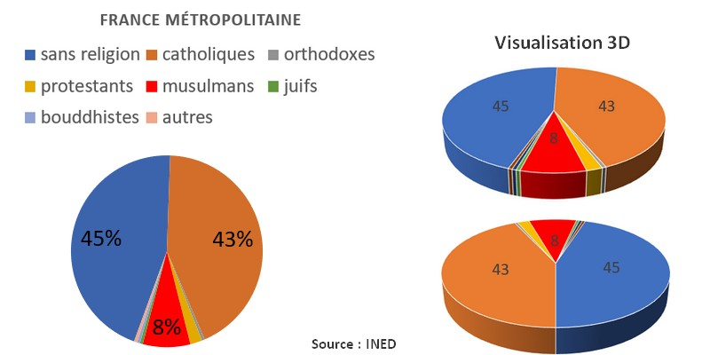</center>

$~$

[Source](https://quoidansmonassiette.fr/tromper-avec-graphiques-representations-visuelles-pour-manipuler-opinion-publique-guide/)

<!-- ************************************************************************ -->
# Grèves : Attention aux axes
<!-- ************************************************************************ -->

## Grèves SNCF

<center>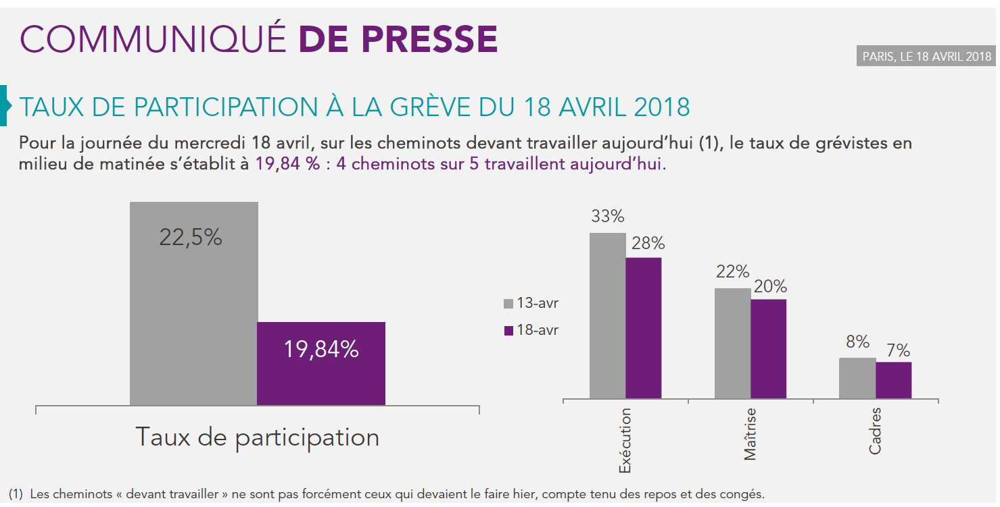</center>

[Source](https://www.liberation.fr/checknews/2018/04/27/est-ce-que-bfmtv-a-vraiment-affiche-un-graphique-a-camembert-trompeur-sur-le-soutien-a-la-greve-des-_1653615/)

## Grèves SNCF : graphique {.smaller}

```{r, fig.height=3.4, fig.width=3.5, fig.align='center'}
greve <- data.frame(jour = c("17/04", "18/04"), pourcent = c(22.5, 19.84))
ggplot(greve, aes(x = jour, y = pourcent, fill = jour)) +
  geom_col() +
  ylab("Taux de participation") + xlab("Date") +
  ggtitle("Taux de participation à la grève \n du 18 avril 2018") + 
  scale_fill_discrete(guide = "none") + 
  geom_text(aes(label = pourcent, y = pourcent - 1.5), size = 8) + 
  theme_minimal()
```


<!-- ************************************************************************ -->
# Attention aux axes
<!-- ************************************************************************ -->

## Places en médecine

<center>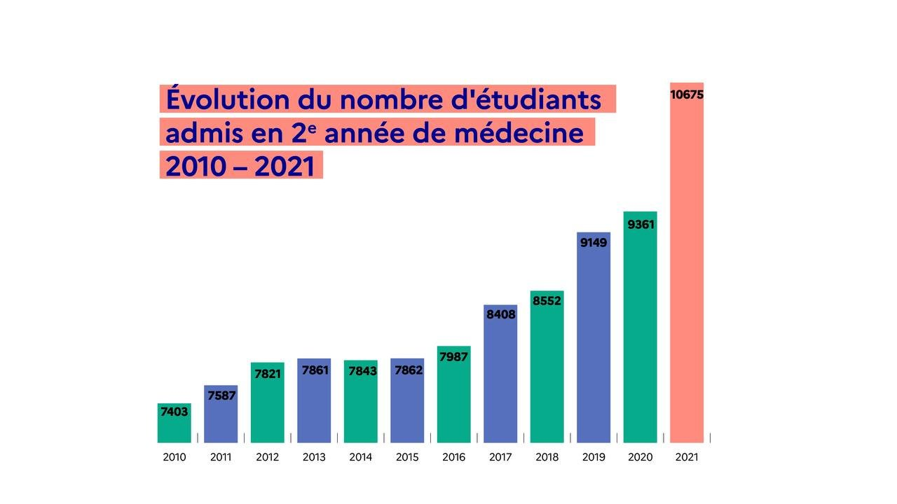</center>

## Places en médecine

```{r, fig.height=5, fig.width=7, fig.align='center', echo = FALSE}
medecins <- data.frame(annee = c(2010:2021),
                       places = c(7403, 7587, 7821, 7861, 7843, 7862, 7987, 8408, 8552, 9149, 9361, 10675))

ggplot(medecins, aes(x = annee, y = places)) +
  geom_col(fill = "lightblue") +
  xlab("") + ylab("") +
  ggtitle("Evolution du nombre d'étudiants admis \n en 2e année de médecine 2010 - 2021") + 
  geom_text(aes(label = places, y = places - 300), size = 4) + 
  theme_minimal()
```

## Places en médecine

<center></center>

<!-- ************************************************************************ -->
# Attention aux axes !
<!-- ************************************************************************ -->

## Evolution du taux global d’imposition

<center>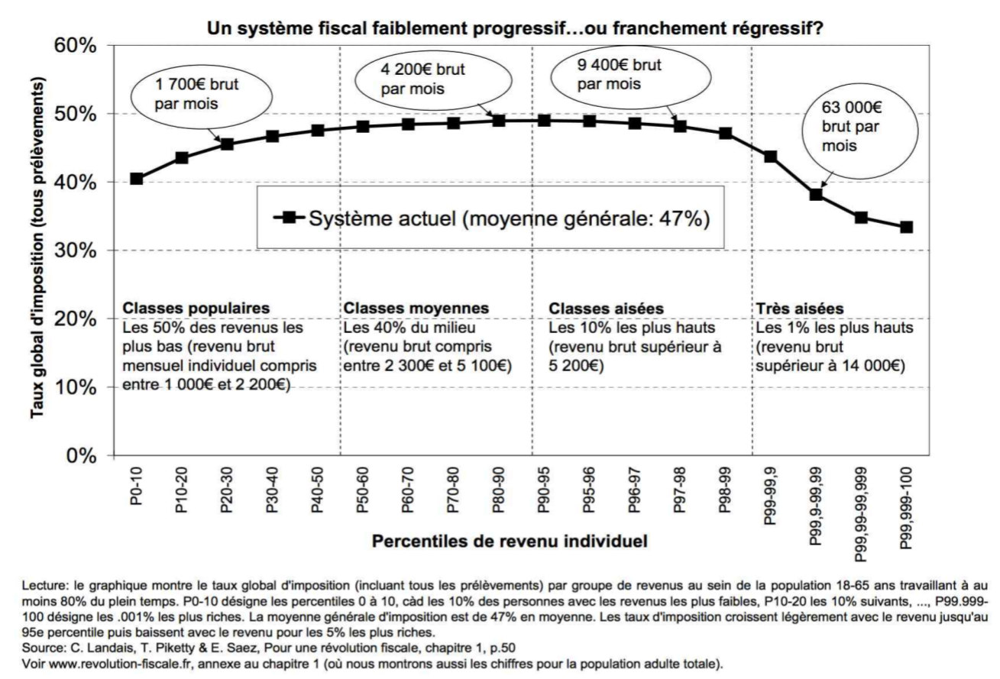</center>

[Landais, Piketty et Saez (2011)](http://www.revolution-fiscale.fr/) et 
[Charpentier (2017)](https://freakonometrics.hypotheses.org/50129)

## Evolution du taux global d’imposition

<center>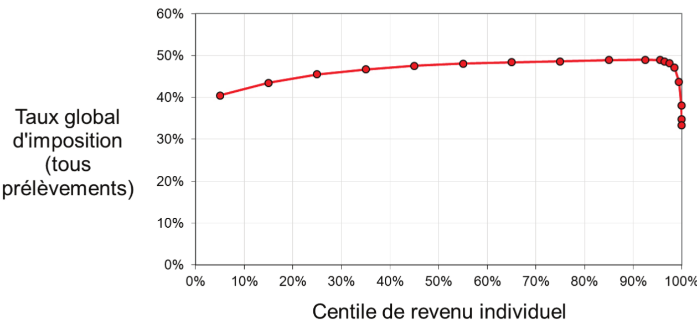</center>

[Guiard (2014)](http://publications-sfds.fr/index.php/stat_soc/article/view/408/387) et 
[Charpentier (2017)](https://freakonometrics.hypotheses.org/50129)

Que faut-il mettre en abscisse ?

## Evolution du taux global d’imposition

<center>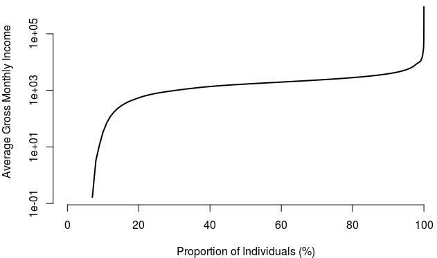</center>

$~$

<div style="float: left; width: 45%;">
<center>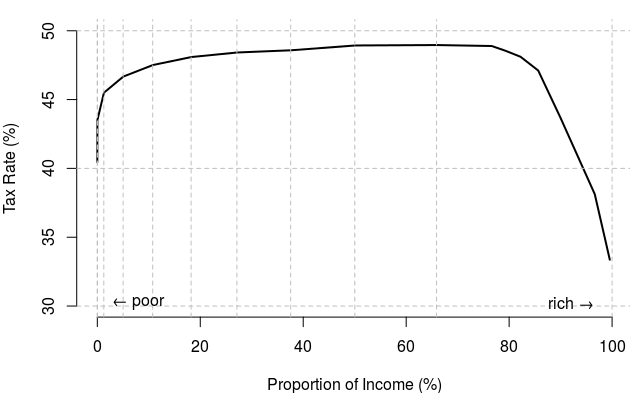</center>
</div>

<div style="float: right; width: 45%;">
<center>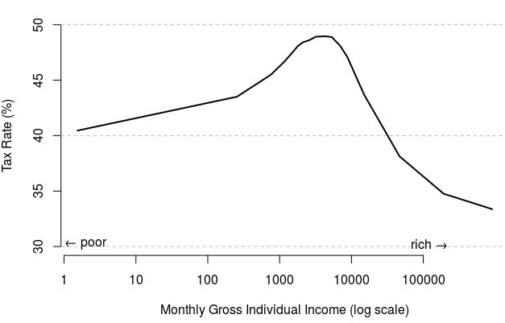</center>
</div>

[Charpentier (2017)](https://freakonometrics.hypotheses.org/50129)

<!-- ************************************************************************ -->
# Quelles Données ?
<!-- ************************************************************************ -->

## Crise de confiance

<center>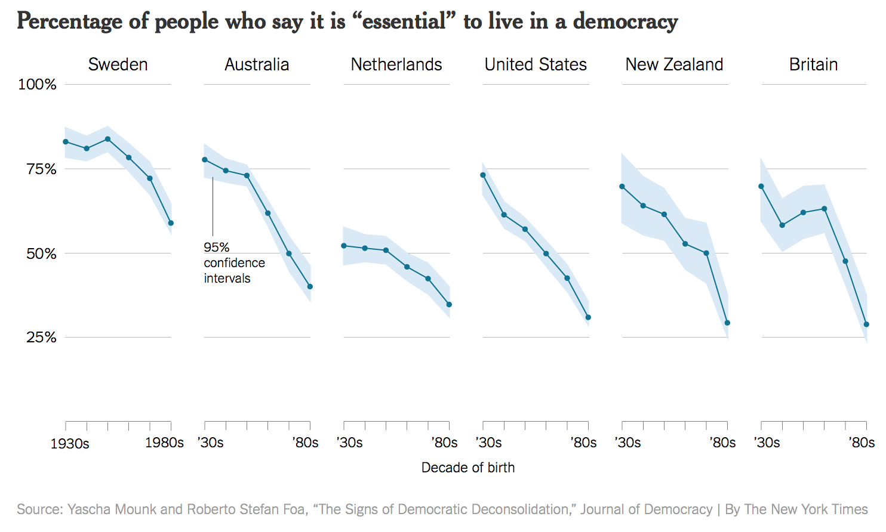</center>

$~$ 
[Source](https://socviz.co/lookatdata.html)

## Crise de confiance ?

<center>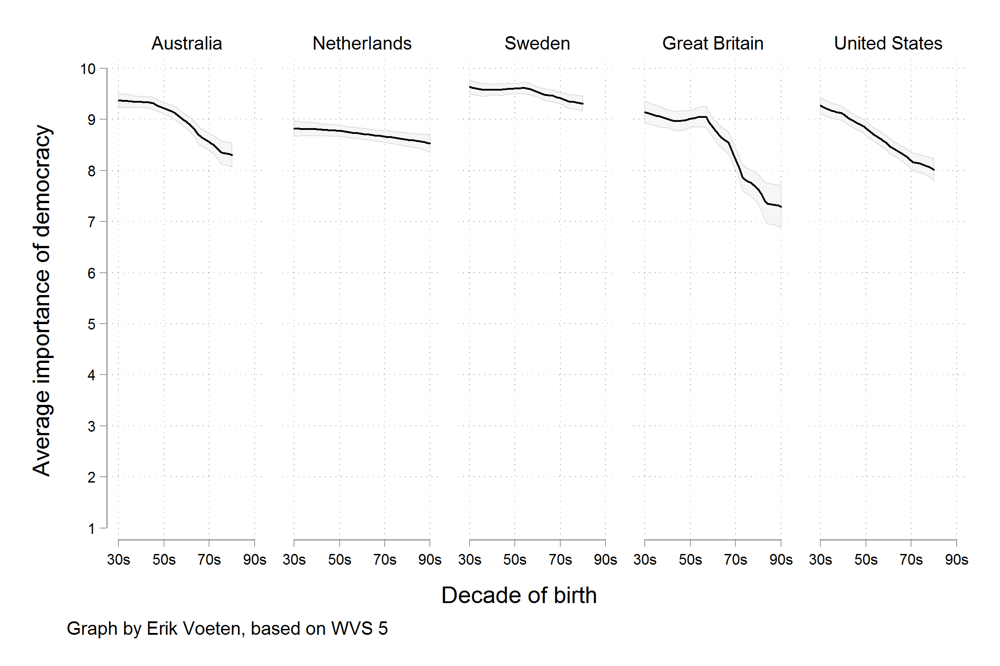</center>

$~$ 
[Source](https://socviz.co/lookatdata.html)

**Choix des données** représentées très important.

<!-- ************************************************************************ -->
# Sondages
<!-- ************************************************************************ -->

## Votes pour Biden et économie

<center>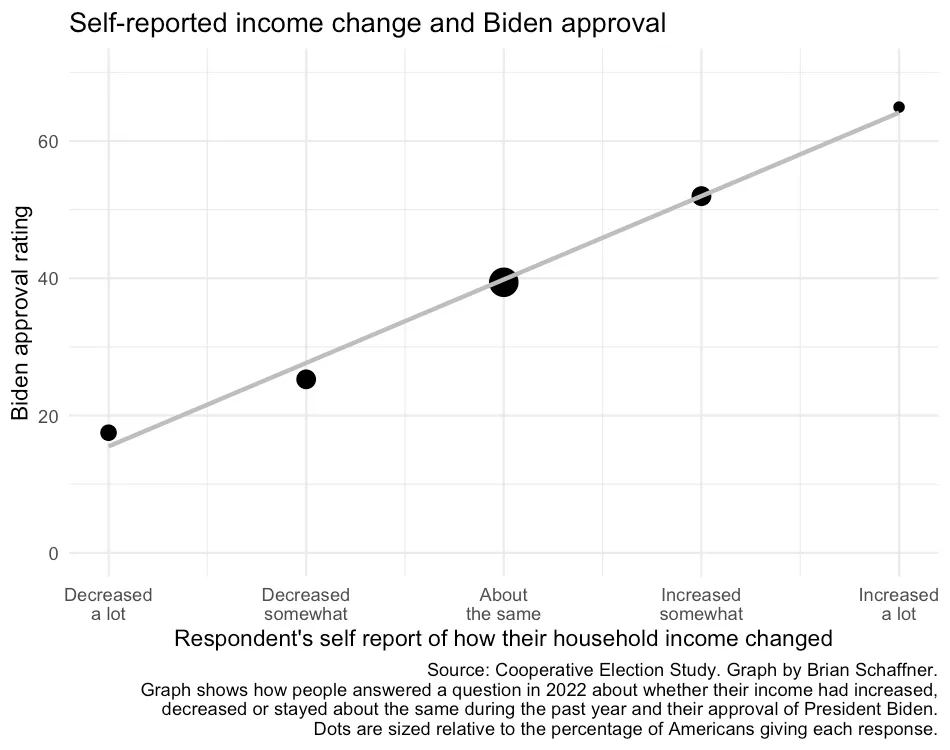</center>

$~$ 
[Source](https://medium.com/3streams/is-it-really-the-economy-stupid-a0806db9140e)

## Votes pour Biden et économie

<center>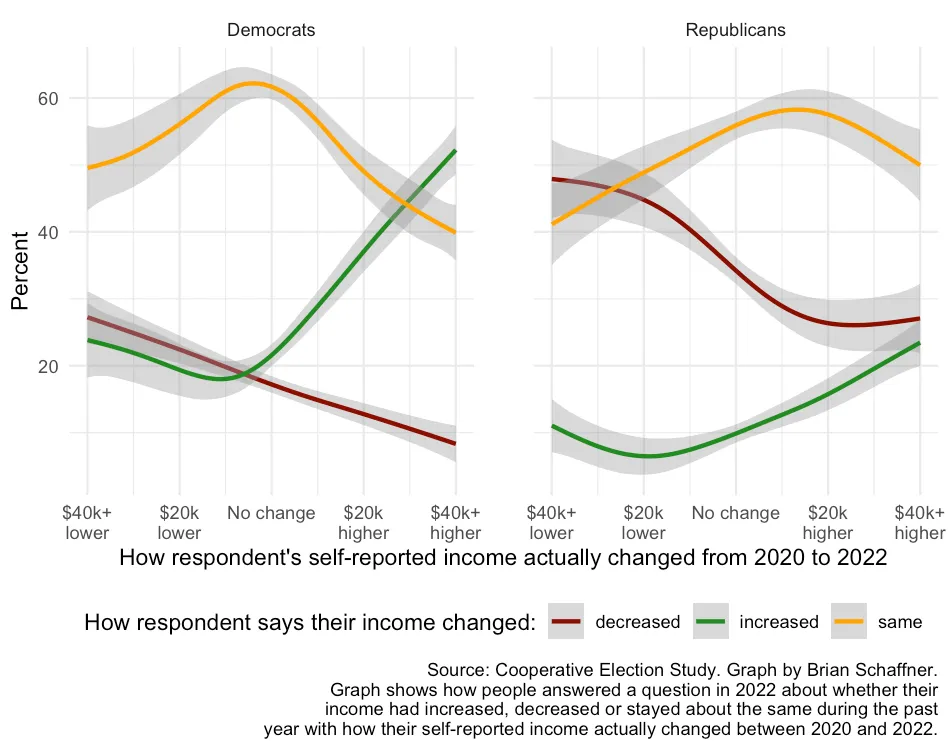</center>

$~$ 
[Source](https://medium.com/3streams/is-it-really-the-economy-stupid-a0806db9140e)

## Votes pour Biden et économie

<center>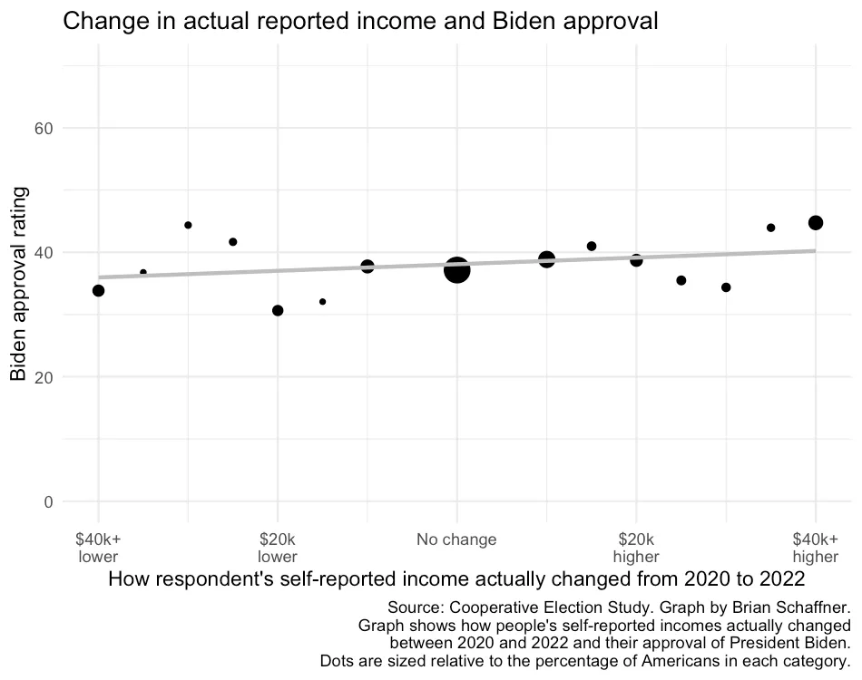</center>

$~$ 
[Source](https://medium.com/3streams/is-it-really-the-economy-stupid-a0806db9140e)

**Sondages** les questions orientent les réponses.

<!-- ************************************************************************ -->
# Comparaison n'est pas raison
<!-- ************************************************************************ -->

## Economic Growth

<center>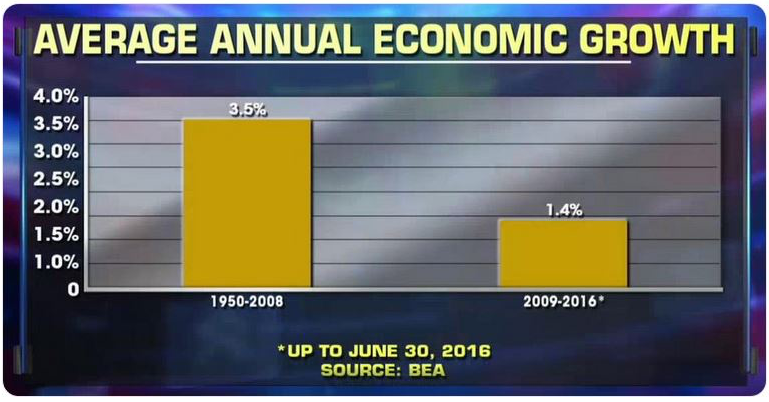</center>


## Economic Growth

<center>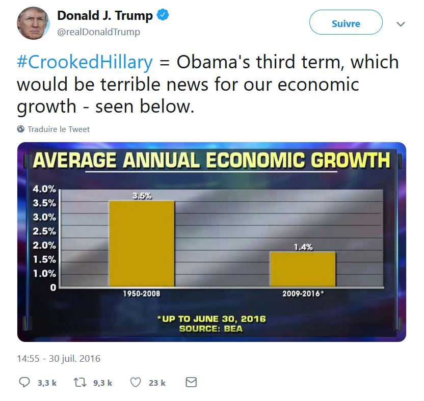</center>


<!-- ************************************************************************ -->
# Régressions
<!-- ************************************************************************ -->

## PISA

<center>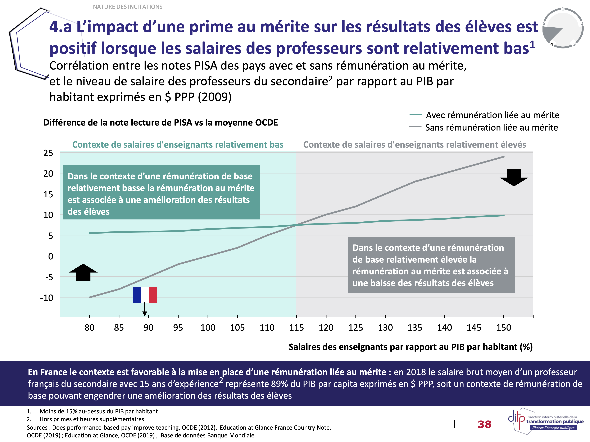</center>


[Source](https://www.documentcloud.org/documents/23570155-20200415_approfondissement-valorisation-du-merite_vf)

## PISA - `ggplot`

```{r, warning=FALSE, message=FALSE, echo=FALSE}
library(here)
pisa <- readxl::read_excel(here("data_raw", "pisa.xls"),
                           sheet = "web_Tab_2", 
                           col_types = c("text", "text", "numeric", 
                                         "numeric", "numeric", "numeric", 
                                         "skip"), skip = 5, n_max = 35)
pisa <- pisa[-1, ]
colnames(pisa)[1] <- "country"
colnames(pisa)[6] <- "score"
pisa$relative_score <- pisa$score - mean(pisa$score, na.rm = TRUE)
pisa$relative_salary <- (pisa$YSALARY) * 100
pisa <- pisa[!is.na(pisa$YSALARY), ]
# pisa$TPP[pisa$TPP == "m"] <- "1"
pisa <- pisa[pisa$TPP %in% c("0", "1"), ]
# pisa_subset <- subset(pisa, YSALARY >= 0.75)
# pisa_subset <- subset(pisa, YSALARY <= 1.5)
```

```{r, message = FALSE}
ggplot(pisa, aes(x = relative_salary, y = relative_score, color = TPP)) +
  geom_smooth(method = "lm", se = FALSE)
```

## PISA - Incertitudes

```{r, message = FALSE}
ggplot(pisa, aes(x = relative_salary, y = relative_score, color = TPP)) +
  geom_smooth(method = "lm")
```

## PISA - Avec les données
```{r, message = FALSE}
ggplot(pisa, aes(x = relative_salary, y = relative_score, color = TPP)) +
  geom_point() + geom_smooth(method = "lm")
```

## PISA - Sans la Corée
```{r, message = FALSE}
ggplot(subset(pisa, country != "Korea"),
       aes(x = relative_salary, y = relative_score, color = TPP)) +
  geom_point() + geom_smooth(method = "lm")
```


<!-- ```{r} -->
<!-- pisa$relsal <- pisa$YSALARY - 1 -->
<!-- pisa$relscore <- pisa$score -->
<!-- pisa$TPPbis <- 1 - as.numeric(pisa$TPP) -->
<!-- noprime <- subset(pisa, TPP == 0) -->
<!-- prime <- subset(pisa, TPP == 1) -->
<!-- fitprime <- lm(relscore ~ relsal, data = prime) -->
<!-- fitnoprime <- lm(relscore ~ relsal, data = noprime) -->
<!-- fitall <- lm(relscore ~ relsal * TPP + YGDP + EXPEND, data = pisa) -->
<!-- summary(fitall) -->
<!-- fiTPP <- lm(relscore ~ TPP, data = pisa) -->
<!-- summary(fiTPP) -->
<!-- fitGDP <- lm(relscore ~ YGDP, data = pisa) -->
<!-- summary(fitGDP) -->
<!-- fitrelsal <- lm(relscore ~ relsal * TPP, data = subset(pisa, relative_salary < 200)) -->
<!-- summary(fitrelsal) -->
<!-- plot(pisa$relsal, pisa$relscore, col = as.numeric(pisa$TPP) + 1) -->
<!-- abline(fitprime) -->
<!-- abline(fitnoprime) -->
<!-- ``` -->

## Sprint

<center>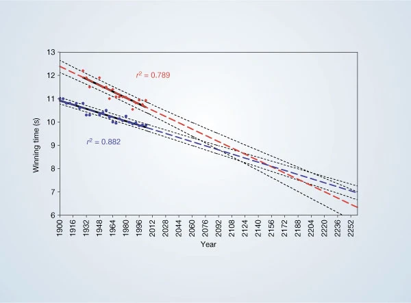</center>

Source: 
Tatem, A., Guerra, C., Atkinson, P. et al. 
Momentous sprint at the 2156 Olympics?
Nature 431, 525 (2004). [doi:10.1038/431525a](https://doi.org/10.1038/431525a)

## Références

- *Fundamentals of Data Visualization* :  
[Introduction](https://clauswilke.com/dataviz/color-basics.html)  
[Chapter 19: Common pitfalls of color use](https://clauswilke.com/dataviz/introduction.html)
- *Data Visualization—A Practical Introduction* :  
[Chapter 1: Look at data](https://socviz.co/lookatdata.html)
